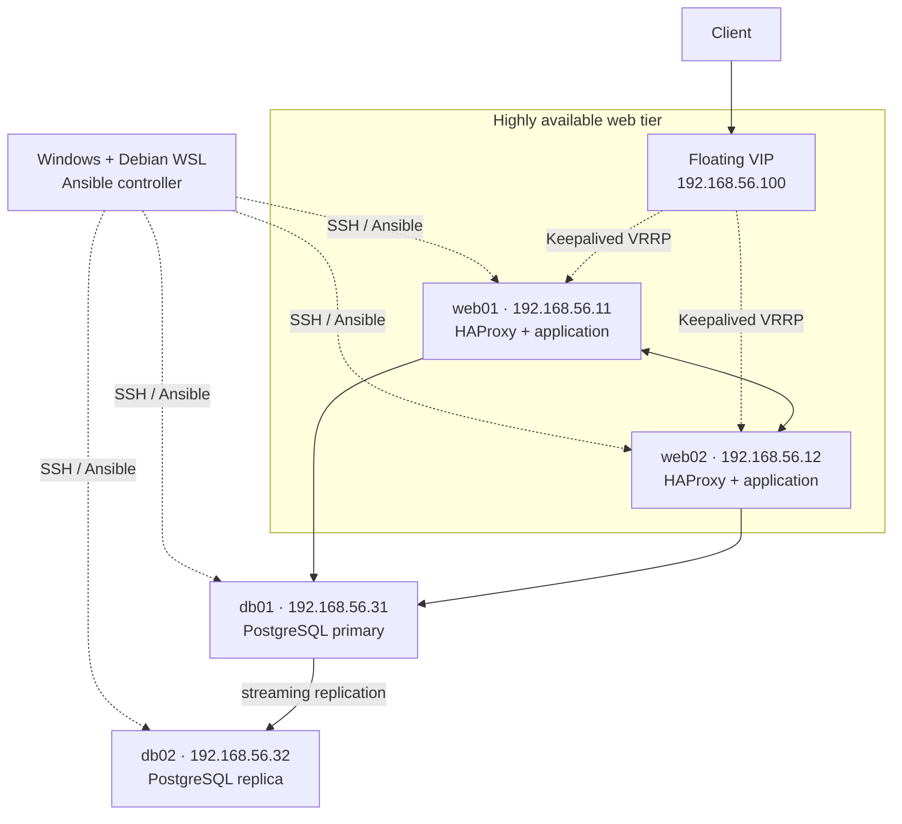

# Four-Node On-Premises High-Availability Lab


A reproducible four-VM infrastructure lab that demonstrates Linux administration, configuration management, web high availability, PostgreSQL streaming replication, zero-downtime deployments, backup recovery, monitoring, and failure testing on modest hardware.

The entire stack is managed with Ansible from Debian WSL on a Windows/VirtualBox host. It has been tested through controlled service failures, an abrupt VM power-off, database recovery, and serial reboots.

## Highlights

- One stable virtual IP with automatic web-node failover
- Health-aware load balancing across two application instances
- PostgreSQL 17 primary/replica streaming replication
- Ansible Vault integration without publishing active secrets
- Backend draining and rolling application deployments
- Daily checksummed backups and an automated restore test
- Node Exporter plus custom application, VIP, and database metrics
- Automated failure injection with guaranteed cleanup
- GitHub Actions checks for Ansible, YAML, Python, shell, documentation, and secrets

## Architecture



HAProxy, Keepalived, and the application are intentionally colocated on the two web nodes to fit a four-VM lab. The web path fails over automatically. PostgreSQL promotion remains a documented manual operation rather than pretending the database tier has safe automatic failover.

## Proven results

| Test | Result |
|---|---|
| Complete second Ansible run | `changed=0`, `failed=0` on all four nodes |
| Rolling deployment | 205 HTTP requests, zero failures |
| Abrupt `web01` power-off | VIP served requests through `web02` after six seconds |
| Replica outage | Primary stayed writable; replica caught up after restart |
| Primary outage | `/health` stayed up; `/db-health` returned an explicit 503 |
| Backup recovery | Deleted test data recovered in an isolated restored database |
| Serial reboot | Every core and role-specific service recovered automatically |

See the [complete verification report](docs/final-results.md) and [failure-test evidence](docs/failure-tests/README.md).

## Topology

| Host | Address | Services |
|---|---|---|
| `web01` | `192.168.56.11` | HAProxy, Keepalived preferred node, application, Node Exporter |
| `web02` | `192.168.56.12` | HAProxy, Keepalived backup node, application, Node Exporter |
| `db01` | `192.168.56.31` | PostgreSQL primary, backups, Node Exporter |
| `db02` | `192.168.56.32` | PostgreSQL read-only replica, Node Exporter |
| VIP | `192.168.56.100` | Stable client entry point |

## Technology

- Debian 13 and systemd
- Ansible Core 2.19
- HAProxy and Keepalived
- PostgreSQL 17 with physical streaming replication
- Python and psycopg2
- Prometheus Node Exporter and textfile metrics
- nftables, OpenSSH, Chrony, and Ansible Vault
- VirtualBox, PowerShell, Bash, WSL, and GitHub Actions

## Repository layout

```text
.
├── .github/                 CI workflow and contribution templates
├── ansible/
│   ├── inventory/           Four-node inventory
│   ├── group_vars/          Non-secret variables
│   ├── examples/            Safe Vault example
│   ├── roles/               Reusable infrastructure roles
│   ├── site.yml             Complete configuration
│   ├── deploy.yml           Rolling deployment
│   ├── restore-test.yml     Safe recovery proof
│   └── failure-tests.yml    Controlled failure suite
├── application/             Demonstration HTTP service
├── bootstrap/               Static private-network configuration
├── diagrams/                Editable architecture source
├── docs/                    Build notes, evidence, and runbooks
└── scripts/                 VirtualBox, WSL, and validation helpers
```

## Prerequisites

- Windows 10 or 11 with WSL 2
- Debian installed in WSL
- Oracle VirtualBox
- Four Debian VMs with roughly 1 GB RAM each
- An SSH key accepted by the `ansible` account on every VM
- Ansible Core 2.19 in WSL

The detailed VM procedure is in the [Phase 2 setup guide](docs/phase-2-vm-setup.md).

## Secrets setup

The real `ansible/group_vars/vault.yml` file is deliberately ignored by Git. Create your own from the safe example before running database or application playbooks:

```bash
cd ansible
cp examples/vault.yml.example group_vars/vault.yml
ansible-vault encrypt group_vars/vault.yml
```

Configure `vault_password_file` in `ansible/ansible.cfg` or provide `--ask-vault-pass`. Never commit the Vault password. See the [secrets guide](docs/secrets.md).

## Running the lab

From PowerShell:

```powershell
wsl.exe -d Debian -- bash '/mnt/c/Users/Usuario/Desktop/1st project/scripts/ansible-playbook-wsl.sh' site.yml
curl.exe --noproxy "*" http://192.168.56.100/
curl.exe --noproxy "*" http://192.168.56.100/health
curl.exe --noproxy "*" http://192.168.56.100/db-health
```

Common operations:

```powershell
# Deploy one backend at a time
wsl.exe -d Debian -- bash '/mnt/c/Users/Usuario/Desktop/1st project/scripts/ansible-playbook-wsl.sh' deploy.yml

# Verify primary-to-replica data flow
wsl.exe -d Debian -- bash '/mnt/c/Users/Usuario/Desktop/1st project/scripts/ansible-playbook-wsl.sh' verify-database.yml

# Prove that a backup can restore deleted data
wsl.exe -d Debian -- bash '/mnt/c/Users/Usuario/Desktop/1st project/scripts/ansible-playbook-wsl.sh' restore-test.yml

# Exercise controlled failures and automatic recovery
wsl.exe -d Debian -- bash '/mnt/c/Users/Usuario/Desktop/1st project/scripts/ansible-playbook-wsl.sh' failure-tests.yml
```

Use the [demonstration runbook](docs/demo.md) for a portfolio walkthrough.

## Security model

- SSH password authentication is disabled after key bootstrap.
- nftables defaults to dropping unsolicited traffic.
- Services are limited to the private lab network.
- Applications run as an unprivileged account with systemd hardening.
- Database credentials are supplied through Ansible Vault and protected environment files.
- Database dumps are mode-protected and checksummed.
- Active credentials, private keys, Vault passwords, dumps, ISOs, and local overrides are ignored by Git.

Backups are not yet encrypted at rest or copied to another physical device. That is an explicit next-phase improvement.

## Documentation

- [Architecture decisions](docs/architecture.md)
- [Demonstration runbook](docs/demo.md)
- [Secrets and safe publishing](docs/secrets.md)
- [Final verification report](docs/final-results.md)
- [Phase 13 GitHub-readiness results](docs/phase-13-results.md)
- [Failure tests](docs/failure-tests/README.md)
- [Contribution guide](CONTRIBUTING.md)
- [Security policy](SECURITY.md)

## Roadmap

- Central Prometheus, Grafana, and Alertmanager
- TLS termination through HAProxy
- Encrypted off-host backups and a disaster-recovery playbook
- Controlled PostgreSQL promotion and application redirection
- Fully automated VM provisioning

## License

Released under the [MIT License](LICENSE).
